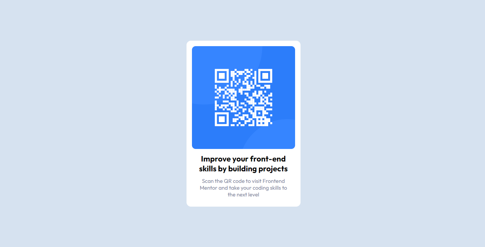

# Frontend Mentor - QR code component solution

This is a solution to the [QR code component challenge on Frontend Mentor](https://www.frontendmentor.io/challenges/qr-code-component-iux_sIO_H). Frontend Mentor challenges help you improve your coding skills by building realistic projects.

## Table of contents

- [Overview](#overview)
  - [Screenshot]()
  - [Links](#links)
- [My process](#my-process)
  - [Built with](#built-with)
  - [What I learned](#what-i-learned)
  - [Continued development](#continued-development)
  - [Useful resources](#useful-resources)
- [Author](#author)
- [Acknowledgments](#acknowledgments)


## Overview

### Screenshot



### Links

- Solution URL: (https://github.com/samiuzaman/Frontend-Mentor---QR-code-component-solution)
- Live Site URL: (https://samiuzaman.github.io/Frontend-Mentor---QR-code-component-solution/)

## My process

### Built with

- Semantic HTML5 markup
- CSS custom properties
- Flexbox
- CSS Grid
- Mobile-first workflow
- [React](https://reactjs.org/) - JS library
- [Next.js](https://nextjs.org/) - React framework
- [Styled Components](https://styled-components.com/) - For styles


### What I learned

I have Learning html css practical knowledge 

```html
<h1>Some HTML code I'm proud of</h1>
```

```css
.card{
    width: 315px;
    background-color: var(--white);
    margin: 0 auto;
    padding: 16px;
    border-radius: 13px;
}
```

### Useful resources

- ([Frontend Mentor](https://www.frontendmentor.io/)) -  This helped me for XYZ reason. I really liked this pattern and will use it going forward.
- ([W3Schools](https://www.w3schools.com/)) - This is an amazing article which helped me finally understand XYZ. I'd recommend it to anyone still learning this concept.


## Author
- Frontend Mentor - [@samiuzaman](https://www.frontendmentor.io/profile/samiuzaman))
- Twitter - [@samiuzzaman201](https://www.twitter.com/samiuzzaman201)
- LinkedIn - [@samiuzaman/](https://www.linkedin.com/in/samiuzaman)


